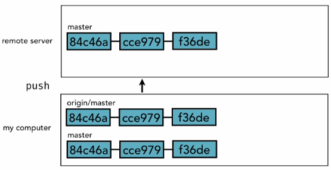
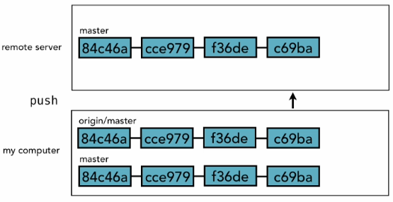
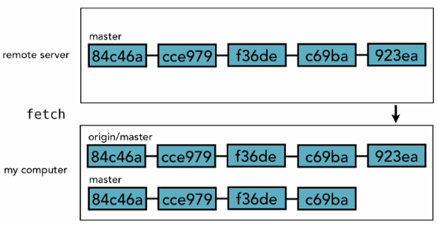
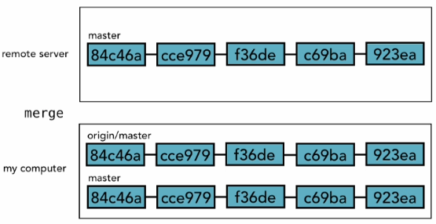
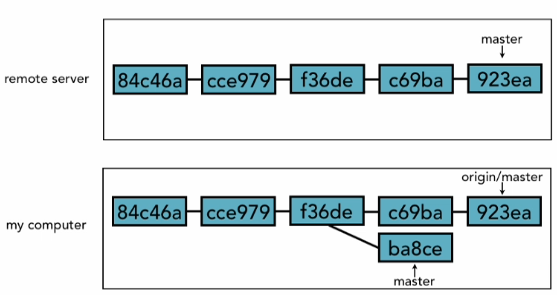

# 38. Using local and remote repositories

## 38.1 `push`
* `add` &#8594; stages files from `working directory` to `staging index`.
* `commit` &#8594; commits files from `staging index` to `local repository`.
* `push` &#8594; clones a branch (master branch) from `local repository` and paste it in `remote repository` for others to see.
* `push` &#8594; at the same time, creates another branch called `origin/<branch>` (`origin/master`) in `local repository`. `origin/master` is a branch on our local machine that references the remote server branch. It always tries to stay in sync.

* we continue to do another commit.
* `push` the code to `remote server`.
* There is also a change made in our `origin/mater` branch. The ones that tries to stay in sync with the remote one.

## 38.2 `fetch`
* `fetch` &#8594; retrieves from `remote repository` to `local repository`.
* `fetch` &#8594; syncs up what is in `remote repository` reflected in `origin/master`. However, it won't bring the change into the `master` branch.

## 38.3 `merge`
* `merge` &#8594; takes the changes from `oring/master` to local `master` branch.

* Here is another scenerio
* master in remote server and origin/mastare are in sync.
* There is a conflicts between origin/master and master in my computer.
* You will have to merge `ba8ce` and `923ea`

* At the end, you will have to `push` the merge to `remote server`.

