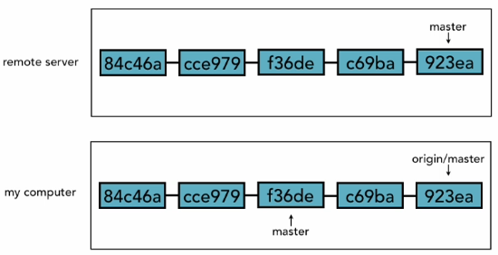
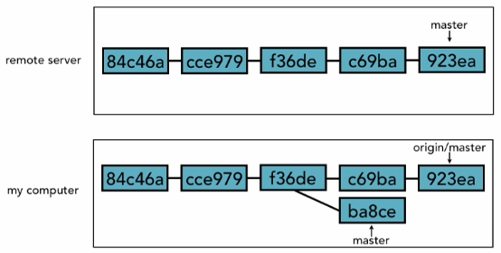

# 46. Merging in fetched changes
* sync up `origin/master` to our local `master` in the local computer.
* `origin/master` cannot be checkout or you cannot commit to it. It is just there to reference `master` in remote repository.

* `master` local is 2 commits behind `origin/master` and `origin/master` and `master` remote are in sync.
* So, we need to merge now.
* In this case, it is the fast-forward merge.

* The diagram above shows that there are conflicts with the merge and it is not a fast-forward merge.
* So, we will resolve the conflicts.
* Given we are on fox branch.

<table><tbody>
  <tr>
    <th>Steps</th>	
    <th>git</th>	    
    <th>Outcome</th>	    
    <th>Notes</th>	            
  </tr>
  <tr>
    <td align="center">1</td>
    <td><code>git branch -a</code></td>
    <td>
      <code>* master </code> 
      <code> remotes/origin/HEAD -> origin/master</code> 
      <code> remotes/origin/master</code> 
      <code> remotes/origin/non_tracking</code> 
    </td>     
    <td></td>            
  </tr>
  <tr>
    <td align="center" rowspan="2">2</td>
    <td><code>git diff origin/master..master</code></td>
    <td colspan="2">
      <code>diff --git a/tours.html b/tours.html </code> 
      <code>index caa9b4c..829eb99 100644</code> 
      <code>--- a/tours.html </code> 
      <code>+++ b/tours.html </code>   
      <code>@@ -83,35 +83,35 @@ </code>           
      <code>  &lt;div class="tourDescription&gt; </code>                 
      <code>  &nbsp; &lt;h2&gt;Claifornia Calm&lt;/h2&gt; </code>                 
      <code>  
        - &nbsp; &lt;p&gt; &lt;img src="asserts/images/calm_desc_bug.fig" width="135" height="120" alt="...
      </code>                       
      <code>
        + &nbsp; &lt;p&gt; &lt;img src="asserts/images/calm_desc_bug.fig" width="135" height="120" alt="...
      </code>  
      <code> &lt;/div&gt; </code>    
      <code>  &lt;div class="tourDescription&gt; </code>                 
      <code>  &nbsp; &lt;h2&gt;Claifornia Hotsprings&lt;/h2&gt; </code>                 
      <code>  
        - &nbsp; &lt;p&gt; &lt;img src="asserts/images/calm_desc_bug.fig" width="135" height="120" alt="...
      </code>                       
      <code>
        + &nbsp; &lt;p&gt; &lt;img src="asserts/images/calm_desc_bug.fig" width="135" height="120" alt="...
      </code>  
      <code> &lt;/div&gt; </code>    
      <code>  &lt;div class="tourDescription&gt; </code>                 
      <code>  &nbsp; &lt;h2&gt;Cycle Claifornia&lt;/h2&gt; </code>                 
      <code>  
        - &nbsp; &lt;p&gt; &lt;img src="asserts/images/calm_desc_bug.fig" width="135" height="120" alt="...
      </code>                       
      <code>
        + &nbsp; &lt;p&gt; &lt;img src="asserts/images/calm_desc_bug.fig" width="135" height="120" alt="...
      </code>  
      <code> &lt;/div&gt; </code>    
      <code>  &lt;div class="tourDescription&gt; </code>                 
      <code>  &nbsp; &lt;h2&gt;From Desert to Sea&lt;/h2&gt; </code>                                   
    </td>	
  <tr>
    <td colspan="3">
     <b>Notes:</b> 
      * You want to see the difference to your local master.  
      * Now, you know that they are different, you want to merge.
    </td>                    
  </tr>  
    
  <tr>
    <td align="center" rowspan="2">3</td>
    <td><code>git merge origin/master</code></td>
    <td colspan="2">
      <code>Updating ab580b5..f3a370e</code> 
      <code>Fast-forward</code>       
      <code>tours.html &nbsp;&nbsp; | &nbsp;&nbsp; 16 +++++++------</code>            
      <code>1 file changed, 8 insertion(+), 8 deletion(-)</code>                   
    </td>	
  </tr>  
  <tr>
    <td colspan="3">
     <b>Notes:</b> 
	  To now merge and it says it is a fast-forward merge. So now, master has the latest change.    
    </td>            
  </tr>
  
  <tr>
    <td align="center">4</td>
    <td><code>git log --oneline -3 master</code></td>
    <td>
	 <code>f3a370e &nbsp; Change file/link format on tours.html</code> 
	 <code>ab580b5 &nbsp; Merge branch 'text_edits'</code>    
	 <code>432e8c6 &nbsp; Replaces staright quotes with curly quotes</code>
    </td>	
    <td>Changes are there.</td>            
  </tr>  
  <tr>
    <td align="center">5</td>
    <td colspan="3">
      * You wanted to make sure your origin/master is up today, so you should do a merge first before we merge.  
      * Always <code>fetch</code>, then <code>merge</code>  
      * There is a shortcut.
      * <code>git pull</code>  
      * <code>git pull = git fetch + git merge</code>  
      * There are pros and cons with <code>git pull</code>, better do both <code>git fetch + git merge</code>
    </td>            
  </tr>    
</tbody></table>
