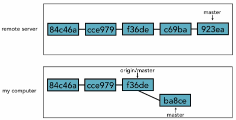
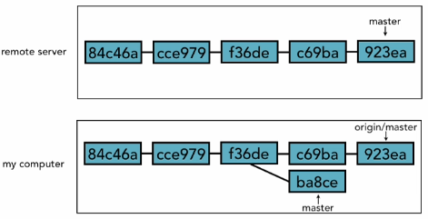

# 48. Pushing to updated remote branch
* You cannot do a `push` to remote server when some others already pushed their code. 
* As discussed, we always do `fetch`, then `merge` and finally `push`.

* we are having issues in the diagram above, it is completely out of sync.
* You will do a fetch like below. so `origin/master` and `master remote` are in sync.

* and then do a merge to keep your `local master` in sync with `origin/master`
* Finally, do a push.

	<table>
	  <tr>
	    <th>Steps</th>	
	    <th>git</th>	        
	    <th>Notes</th>	
    	  </tr>
	  <tr>
	  <tr>
	    <td align="center">1</td>
	    <td><code>git fetch origin</code></td>
	    <td>
	      Make sure <code>origin/master</code> and remote are in sync.  
	      We can only commit to local `master`
	    </td>            
	  </tr>
	  <tr>
	    <td align="center">2</td>
	    <td><code>git merge origin/master</code></td>
	    <td>
	      We <code>merge</code> so our local master will contain everything from origin/master.</td>            
	  </tr>
	  <tr>
	    <td align="center">3</td>
	    <td><code>git push origin master</code></td>
	    <td>Finally <code>push</code> our ultimate origin/master to remote master.</td>            
	  </tr>
	</table>

